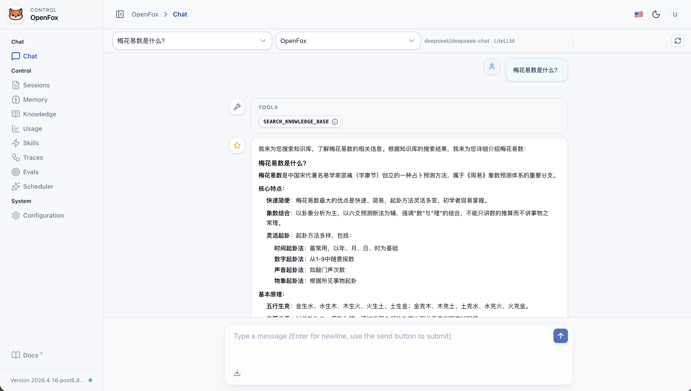
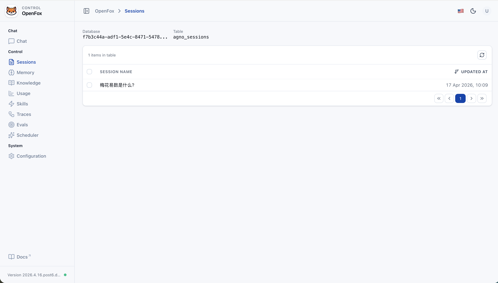
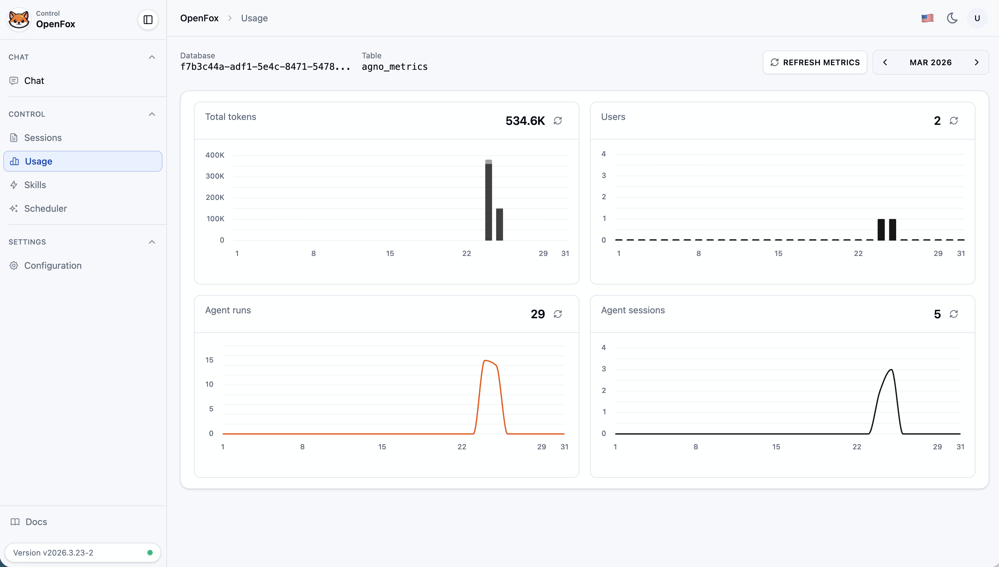
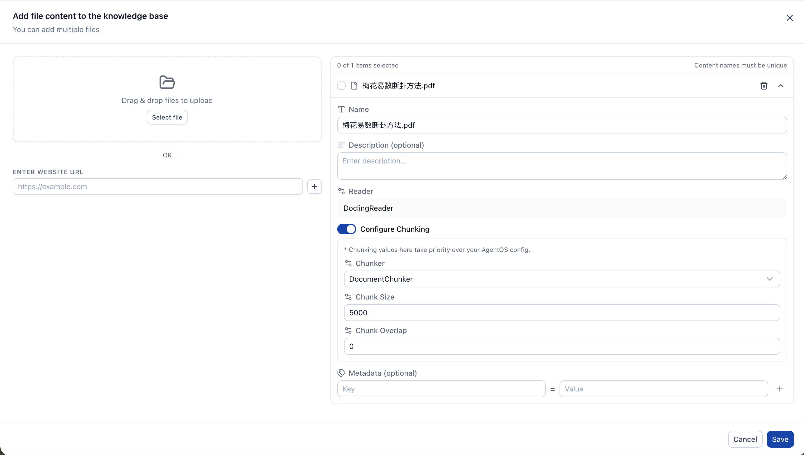
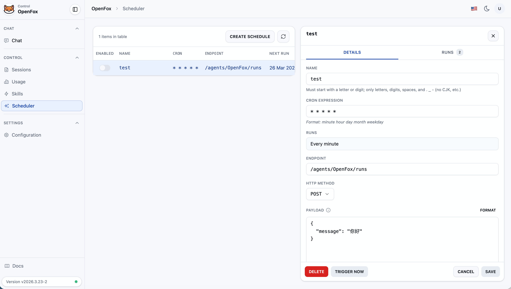
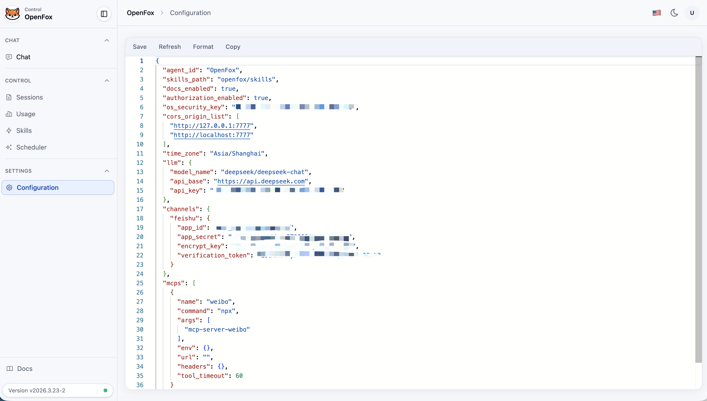

<p align="center">
  <a href="./README.md">English</a> | <a href="./README-zh_CN.md">简体中文</a>
</p>

<p align="center">
  
</p>

<p align="center">
  <strong>自托管个人 AI 助手</strong><br />
  飞书通道 · 内置 Web 控制台 · LiteLLM 多模型
</p>

<p align="center">
  <a href="https://docs.python.org/3.12/"></a>
  <a href="https://github.com/agno-agi/agno"></a>
  <a href="https://fastapi.tiangolo.com/"></a>
</p>

---

## 它是什么

**OpenFox** 跑在你自己的机器上：把 **大模型对话、定时任务、飞书机器人、浏览器工具、MCP、本地技能** 收拢到同一套 HTTP 服务里。默认带 **嵌入式 Web UI**（`/web`），也可在飞书中与助手对话。

| 路径 | 说明 |
|------|------|
| `~/.openfox/config.json` | LLM、飞书、`cors_origin_list`、MCP 等配置 |
| `~/.openfox/storage.db` |使用的 **SQLite** 会话与调度存储 |

---

## 功能一览

| 能力 | 说明 |
|------|------|
| **Web 控制台** | 聊天、会话列表、用量指标、技能上传/管理、Cron 调度、JSON 配置编辑（需登录，使用配置里的 `os_security_key`） |
| **飞书** | 事件与消息接入，单聊/群聊（可 @ 机器人） |
| **定时任务** | 内置调度器；对话里可用自然语言创建周期任务（CronTools），回调 Agent 指定端点 |
| **工具** | `run_shell`（Shell）、**Playwright 浏览器工具**（BrowserTools）、飞书发消息等（FeishuTools）、**MCP**（`config.mcps` 配置）、对话中维护 MCP 声明（MCPConfigTools）、config 读写（ConfigTools） |
| **技能** | `openfox/skills` 下 `SKILL.md`（LocalSkills）；Web 端支持上传技能包 |
| **模型** | 通过 **LiteLLM** 对接 OpenAI 兼容 API（详见下文「模型」） |

---

## 快速开始

**环境**：Python **3.12+**，建议用 [uv](https://github.com/astral-sh/uv) 安装依赖后进入项目根目录。

```bash
uv sync   # 或 pip install -e .
```

**首次启动**：若没有 `~/.openfox/config.json`，会先走一轮交互式初始化（API 文档开关、鉴权、`os_security_key`、时区、LLM、飞书等），然后启动服务。

```bash
python -m openfox
# 默认监听 0.0.0.0:7777
```

需要自定义 `--host` / `--port` 时，可先执行 `python -m openfox --help` 查看 CLI 中的子命令与参数说明。

- **Web UI**：浏览器打开 `http://127.0.0.1:7777/web`（端口按实际修改）。
- **鉴权 Token**：即配置中的 `os_security_key`，在 Web 登录页填入。
- **非 7777 端口**：默认 CORS 预置了 `:7777` 的 `/web` 来源；若改端口，请在 `cors_origin_list` 中加入例如 `http://127.0.0.1:<端口>` 与 `http://localhost:<端口>`，否则前端可能无法访问 API。

仅想重新初始化时，可删除 `~/.openfox/config.json` 后再次执行 `python -m openfox`（会再次跑向导）。已有配置时会跳过向导直接启动。

---

## 飞书接入

请求根路径前缀为 **`/feishu`**。

- 事件 / Webhook 示例：`http://<你的主机或域名>/feishu/event`（以开放平台实际要求的路径为准，需与路由配置一致）。

步骤摘要：

1. 在 [飞书开放平台](https://open.feishu.cn/) 创建应用，获取 **App ID**、**App Secret**。
2. 配置事件订阅与消息权限，请求 URL 指向你的服务（公网或内网穿透），填写 **Encrypt Key**、**Verification Token**。
3. 将上述信息写入 `~/.openfox/config.json` 的 `channels.feishu`，重启 `python -m openfox`。
4. 在飞书单聊或群聊中使用应用能力（如 @ 机器人）与 OpenFox 对话。

---

## 模型（LiteLLM）

OpenFox 使用 **LiteLLM** 调用模型，只要在 [LiteLLM 支持的提供商](https://docs.litellm.ai/docs/providers) 范围内、走 OpenAI Chat Completions 风格接口，一般只需改 `llm.model_name` / `llm.api_base` / `llm.api_key`。

示例型号（完整列表见官方文档）：

```text
openai/gpt-4o-mini
deepseek/deepseek-chat
dashscope/qwen-max
ollama/llama3.1
...
```

---

## 界面预览

### 飞书中使用效果


### Web UI

<p align="center"><strong>聊天</strong></p>
<p align="center"></p>

<p align="center"><strong>会话</strong></p>
<p align="center"></p>

<p align="center"><strong>使用情况</strong></p>
<p align="center"></p>

<p align="center"><strong>技能</strong></p>
<p align="center"></p>

<p align="center"><strong>定时任务</strong></p>
<p align="center"></p>

<p align="center"><strong>配置</strong></p>
<p align="center"></p>

---

## 内网穿透（可选）

- [zeronews](https://user.zeronews.cc/setup/start)

---

## 与 OpenClaw 的简单对比

| 维度 | OpenClaw | OpenFox |
|------|----------|---------|
| 技术栈 | Node / TypeScript | Python、Agno、FastAPI |
| 通道 | 多平台即时通讯 | 飞书为主（可扩展） |
| 扩展 | 浏览器、Canvas、Cron 等 | Cron、Shell、浏览器（Playwright）、MCP、本地 Skills |
| 定位 | 全平台个人助手 | 自托管、中英文场景、轻量中控与 Web 一体 |

---

## 致谢与支持

> 你的加 Star 是我们持续改进的动力。

### 交流群

加群请注明来意，留言 **openfox**：

<p align="center">
  
</p>
